# 2025年十二大最佳旅游活动预订平台(持续更新)

旅行时总是为找靠谱的当地体验发愁——网上攻略看花眼、不知道哪些景点值得去、临时想订一日游却发现满员、语言不通沟通困难。现在有一批专业的旅游活动预订平台,聚合全球各地的景点门票、向导服务、一日游、当地体验等资源,提前在线预订、免排队快速入场、中文客服支持。这份榜单整理了12个值得关注的旅游活动预订平台,覆盖全球热门目的地和小众路线,帮你轻松规划每一站的行程安排。

***

## **[Shouf](https://www.shouf.io)**

专注中东和非洲地区的本地化旅游预订平台。

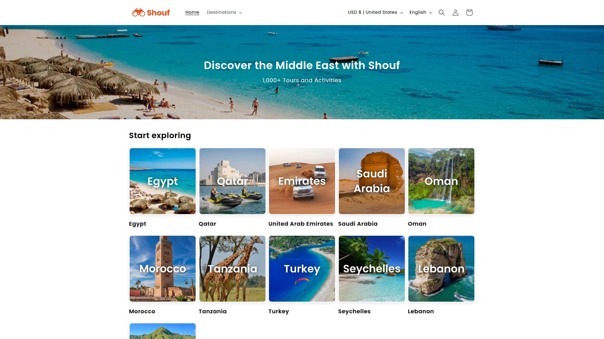

Shouf是一个专门服务中东和非洲市场的旅游活动预订平台,覆盖30多个城市,提供超过1000种精选体验。品牌名"Shouf"在阿拉伯语中意为"看"或"探索",恰好体现了平台帮助旅行者发现和探索当地文化的使命。

**核心优势:** Shouf深耕中东地区,与当地旅游资源深度绑定,能提供其他国际平台没有的独家体验。卡塔尔的国家博物馆、内海沙漠、伊斯兰艺术博物馆、瓦其夫市集;阿曼的比马沙坑、瓦迪巴尼哈立德、达雅米亚特群岛、尼兹瓦堡垒、苏丹卡布斯清真寺等热门景点和活动都能在平台上预订。

Shouf提供英语和阿拉伯语双语客服支持,通过电话、邮件和WhatsApp全天候在线。这对于不熟悉当地语言的国际游客来说非常友好,遇到问题能及时沟通解决。支付方式灵活,接受借记卡、信用卡、Apple Pay、Google Pay等主流支付手段。

大部分活动支持提前24小时免费取消并全额退款,行程变化时不会损失费用。这种灵活的退改政策降低了预订风险,特别适合行程不完全确定的自由行旅客。平台展示的所有体验都经过人工筛选,确保质量可靠,并且附带真实用户评价——目前累计超过5000条评价,平均评分4.8星。

**适用场景:** 特别适合计划前往中东旅行的游客,比如迪拜、多哈、马斯喀特等城市的深度游。如果你对中东文化、历史遗迹、沙漠探险、海岛浮潜等体验感兴趣,Shouf的本地化优势能提供更地道和深入的行程选择。平台界面简洁,预订流程顺畅,适合各年龄段的旅行者使用。

***

## **[GetYourGuide](https://www.getyourguide.com)**

欧洲市场领先的高品质体验预订平台。

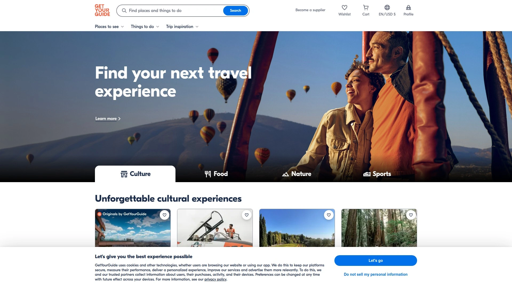

GetYourGuide是一家成立于2009年的德国公司,专注于策划高品质的旅游体验。与其他平台追求数量不同,GetYourGuide强调"质量优先于数量",所有上架的活动都经过严格审核,确保服务水平和安全性达标。

平台特别擅长欧洲旅游资源,从巴黎卢浮宫免排队门票、罗马斗兽场专业导览,到巴塞罗那圣家堂快速通道、阿姆斯特丹运河游船,欧洲各大城市的经典景点和小众体验应有尽有。GetYourGuide还提供文化深度游、美食品鉴、自然探险等主题活动,满足不同旅行偏好。

**用户体验:** 网站设计非常用户友好,导航清晰,搜索和筛选功能强大。可以按目的地、日期、价格区间、活动类型快速定位想要的体验。每个活动页面都有详细的描述、时长、包含/不包含项目、集合地点、取消政策等信息,还有大量真实用户评价和照片供参考。

GetYourGuide的评价系统值得信赖,只有参加过活动的用户才能留下评价,避免了虚假好评。很多用户反馈"GetYourGuide选择的导游知识渊博、热情友好""活动安排合理,时间把控得很好""客服响应迅速,解决问题专业"。

---

## **[Viator](https://www.viator.com)**

Tripadvisor旗下的全球最大活动预订平台。

Viator自2014年被Tripadvisor收购后,依托母公司庞大的用户基础和评价系统,成为全球规模最大的旅游活动预订平台之一。数据库包含超过30万种旅游活动,覆盖全球几乎所有热门目的地。

Viator的策略是"数量优先",给用户提供尽可能多的选择。同一个景点可能有几十种不同的游览方式——半日游、全日游、夜游、私人包车、小团队、大团队、带餐饮、不带餐饮等各种组合。这种丰富的选择让游客能找到最符合自己时间安排和预算的方案。

需要注意的是,Viator不会主动下架持续收到差评的服务商,而是把选择权交给消费者——你可以看到所有评价,自己判断是否值得预订。这种开放性有利有弊:好处是选择多,坏处是需要花时间仔细筛选,避开质量不佳的活动。

**适用人群:** Viator适合需要在全球各地预订活动的频繁旅行者,特别是去欧洲和北美的游客。如果你喜欢经典的观光游览、博物馆门票、一日游短途旅行,Viator的库存充足。平台支持多语言,结账流程简单,大部分活动支持灵活退改。

***

## **[Klook](https://www.klook.com)**

亚太地区旅游活动预订的首选平台。

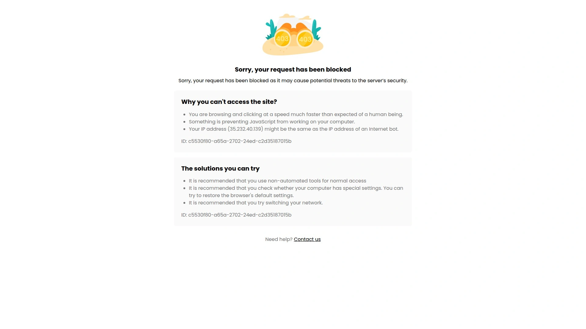

Klook成立于2014年,总部位于香港,最初专注于亚太市场,现在已经快速扩展到全球。Klook在亚洲的资源优势明显,日本、韩国、泰国、新加坡、马来西亚、台湾、香港等地的活动覆盖全面且价格有竞争力。

**价格优势:** Klook经常提供比竞争对手更低的价格,特别是在亚洲市场。平台会推出限时闪购、组合套餐、首单优惠等促销活动,精打细算的旅行者能省下不少钱。除了景点门票和一日游,Klook还销售交通票券(JR Pass、地铁卡、机场接送)、WiFi租赁、eSIM卡等旅行周边服务,真正做到一站式预订。

Klook的主题乐园门票特别受欢迎,东京迪士尼、大阪环球影城、新加坡环球影城、香港迪士尼等热门乐园的门票经常比官网便宜。用户评价普遍提到"价格实惠""电子票使用方便,扫码就能入场""客服回复快"。

**移动端体验:** Klook的App设计优秀,功能完善,支持离线查看已预订的活动,在没有网络的情况下也能查看行程细节和二维码。适合把手机作为主要工具的年轻旅行者。如果你计划去亚洲旅行,Klook是必装的App之一。

***

## **[Headout](https://www.headout.com)**

主打最后一刻预订的快速体验平台。

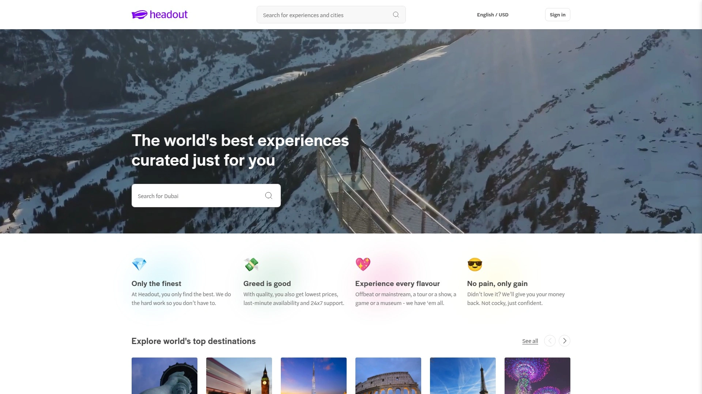

Headout成立于纽约,目标是解决"临时想做点什么但不知道去哪"的痛点。平台强调即时预订能力,很多活动支持当天预订,甚至几小时前预订也能成功。对于行程灵活、喜欢随性探索的旅行者来说,Headout的即时确认功能非常实用。

Headout覆盖全球100多个城市的景点门票、博物馆通票、百老汇演出、音乐会、体育赛事等各类体验。免排队门票是热门品类,可以跳过长长的队伍直接进入景点。平台还提供个性化推荐,根据你的兴趣和旅行风格推送合适的活动。

**价格承诺:** Headout承诺"最佳价格保证",如果你在其他地方找到更低价格,可以联系客服匹配价格。很多活动支持灵活取消,改变计划时不会损失全部费用。支付方式包含"先订后付"选项,不需要立即支付就能锁定位置。

需要注意的是,Headout的用户评价两极分化。满意的用户赞扬"预订快速""票务电子化方便""客服支持及时";不满意的用户则投诉"票务发送延迟""退款处理慢""客服难以联系"。建议预订后及时检查确认邮件,确保票务按时收到。Trustpilot上Headout的评分4.2星(满分5星),属于中等偏上水平。

***

## **[TourRadar](https://www.tourradar.com)**

多日游和团队旅行的专业预订平台。

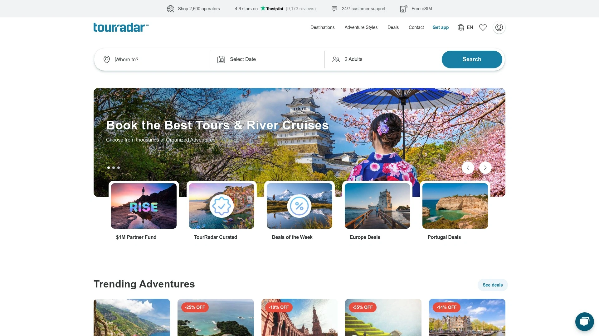

TourRadar与前面几个平台的定位不同,专注于多日游、长途旅行、探险之旅、河轮游等需要多天的旅游产品。如果你不想自己规划复杂的长途旅行,希望参加有向导、有行程安排、有同行伙伴的团队游,TourRadar是理想选择。

平台汇集了全球5万多个多日游行程,从预算型背包客团到奢华小团,从文化遗产游到野生动物探险,各种风格和预算都有覆盖。你可以按目的地、旅行时长、价格区间、旅行风格(探险、文化、野生动物、徒步等)筛选合适的行程。

**真实评价系统:** TourRadar展示的都是真实旅行者的评价和照片,帮你了解行程的实际体验。很多热门路线有上千条评价,可以看到详细的反馈——导游水平、住宿条件、餐食质量、交通安排、行程节奏等方方面面。

TourRadar的App功能丰富,下载后可以参加每月最高3000美元的抽奖活动,享受App专属折扣(最高50%),出发前72小时还能领取免费eSIM卡。24/7客户支持、灵活付款选项、预订保护等服务让长途旅行更安心。适合喜欢团队旅行、追求省心省力、希望结识同行旅伴的旅行者。

***

## **[Airbnb Experiences](https://www.airbnb.com/s/experiences)**

本地达人带你深度体验城市生活。

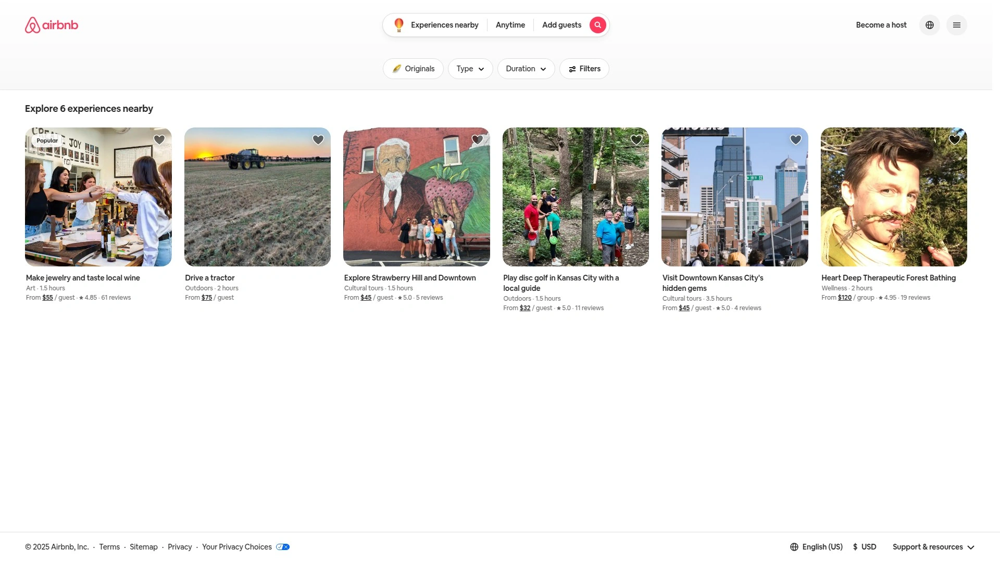

Airbnb Experiences是Airbnb推出的体验预订服务,和传统旅游团不同,这里的活动由本地居民主持,强调真实性和独特性。你可以跟着本地厨师学做传统菜肴、和街头艺术家探索涂鸦文化、跟专业摄影师拍出网红照片、和本地人一起参加节日庆典。

Airbnb Experiences特别适合追求深度文化体验的旅行者。活动规模通常较小(几个人到十几个人),主持人能照顾到每位参与者,互动性强。很多体验是其他平台找不到的独家内容,比如和墨西哥职业摔跤手学习摔跤技巧、和当地音乐家一起即兴演奏、在艺术家工作室创作作品。

**适合网红打卡:** 如果你是社交媒体活跃用户,喜欢拍照发朋友圈或Instagram,Airbnb Experiences有很多专门为拍照设计的体验。一些主持人会带你去小众拍摄地点,指导你摆pose,帮你拍出专业水准的照片,甚至提供服装和道具。这类体验在年轻旅行者中很受欢迎。

Airbnb的评价系统双向透明,主持人也会评价参与者,确保活动质量和参与者素质。预订前可以看到主持人的详细介绍、用户评价、活动包含的内容。大部分体验支持灵活退改,提前一定时间取消可以全额或部分退款。

***

## **[GoCity](https://gocity.com)**

城市景点通票,一卡玩遍多个景点。

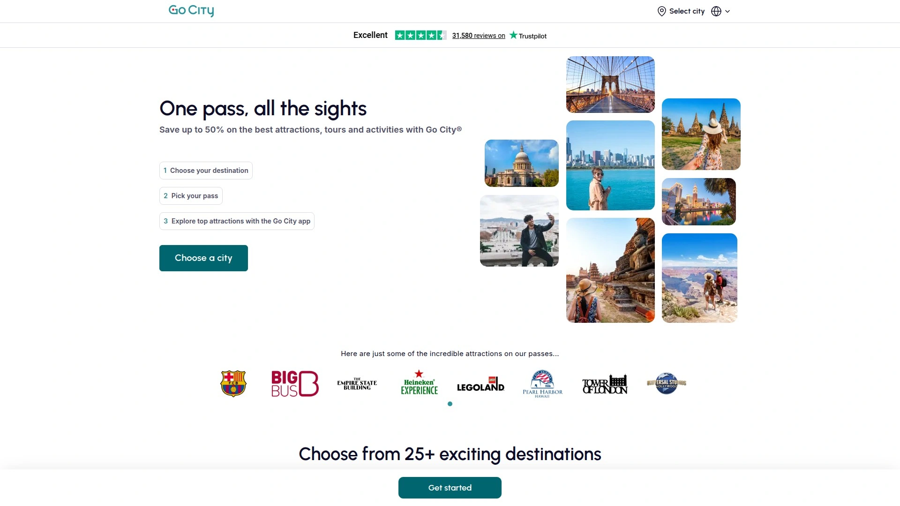

GoCity(以前叫Go City Pass)提供的不是单个活动预订,而是城市景点套票。购买一张通票后,可以在有效期内进入多个景点,无需每个景点单独买票。这种模式特别适合计划在一个城市待几天、想密集游览多个景点的旅行者。

GoCity目前覆盖全球25个以上主要城市,包括纽约、芝加哥、巴黎、罗马、香港、东京等。每个城市的通票包含几十到上百个景点和活动,从博物馆、观景台、游船到主题乐园、美食体验都有涵盖。

**两种通票模式:** GoCity提供两种选择——按天数购买的全包通票和按景点数量购买的景点选择通票。全包通票适合想尽可能多玩景点的旅行者,在有效天数内无限次进入包含的景点。景点选择通票适合有明确目标、只想去几个特定景点的旅行者,选择想去的2个、3个、5个或更多景点,价格相应调整。

GoCity的价值取决于你的游览强度。如果能在有效期内去很多景点,确实比单独购买门票省钱。但如果行程悠闲,只去少数几个地方,单独买票可能更划算。建议先列出想去的景点,计算总票价,再和GoCity的通票价格对比,看是否值得购买。

***

## **[Tiqets](https://www.tiqets.com)**

博物馆和文化景点的电子票务专家。

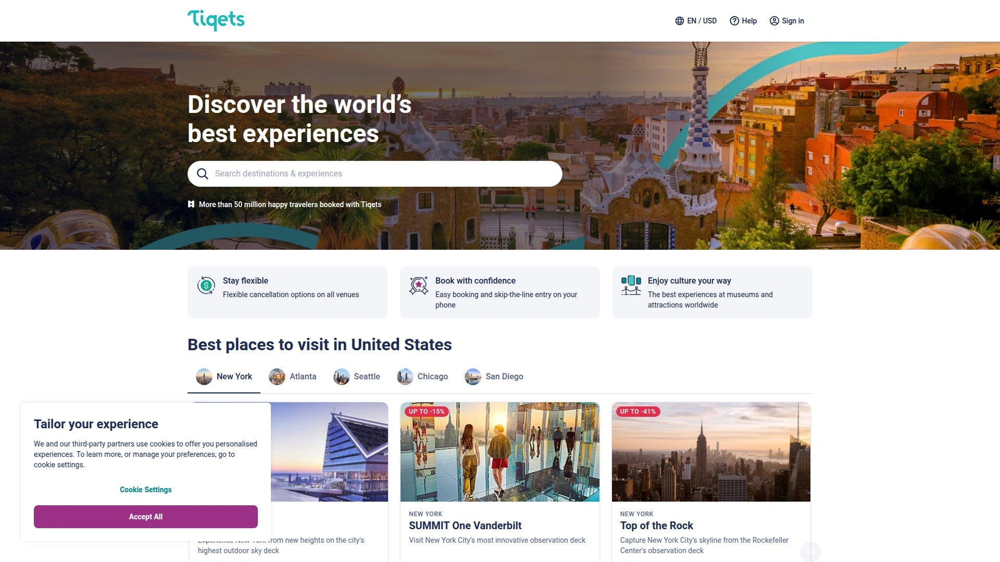

Tiqets专注于博物馆、艺术馆、历史遗迹等文化类景点的门票销售。如果你是文化爱好者,喜欢参观博物馆、美术馆、教堂、宫殿,Tiqets是非常好的预订渠道。平台与全球数千个文化景点合作,提供快速入场、免排队、语音导览等服务。

Tiqets的电子票务系统非常先进,购买后立即收到电子票,保存在手机里,到景点扫码就能进入,无需打印纸质票或在现场兑换。这种无纸化体验环保且方便,特别适合随身没带打印机的旅行者。

**即时可用性:** Tiqets上的很多门票支持即买即用,适合临时决定去某个景点的情况。免排队门票能跳过售票处的长队,直接从快速通道进入,节省宝贵的旅行时间。部分景点还提供时段预约功能,选择人少的时间参观,获得更好的体验。

Tiqets的用户评价系统帮助你了解景点的实际情况——是否值得去、需要多长时间、有哪些亮点、是否适合儿童等。客服支持多语言,遇到问题可以通过邮件或在线聊天获得帮助。适合文化深度游、博物馆爱好者、追求便捷入场体验的旅行者。

***

## **[Intrepid Travel](https://www.intrepidtravel.com)**

负责任旅行的小团队探险专家。

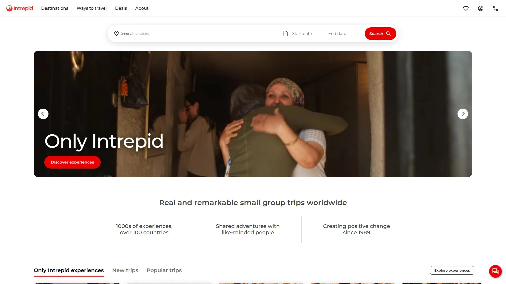

Intrepid Travel是一家澳大利亚公司,专注于小团队探险旅行,强调负责任和可持续的旅游方式。品牌自1989年成立以来一直坚持"用尊重当地人和环境的方式旅行",是获得B Corp认证的企业,承诺将商业作为向善的力量。

Intrepid的旅行团通常控制在12-16人,远小于传统大巴团的规模。小团队可以去大团队去不了的地方,比如狭窄的小巷、家庭经营的餐馆、需要预约的小型工坊。人数少也更容易建立联系,团员之间能成为朋友,一起分享旅行的喜悦。

**本地向导:** Intrepid的所有旅行团都由本地向导带领,他们不仅了解景点历史,更能分享本地人的生活方式、推荐隐藏的好去处、介绍文化背景和社会现状。向导通常会带团队去自己喜欢的餐厅、市集、咖啡馆,体验真实的本地生活而非旅游景点的表面。

Intrepid的行程平衡性很好,既有团队活动,也有自由时间让你独自探索或休息。不会每天排得满满当当,给你足够的空间感受目的地的氛围。Intrepid Foundation是品牌的非营利基金会,支持世界各地的社区项目,旅行收入的一部分用于改善当地社区。

TourRadar上Intrepid Travel有近1.2万条评价,整体评分很高。适合追求深度体验、重视可持续旅行、希望结识志同道合旅伴、不想操心行程规划的旅行者。

***

## **[G Adventures](https://www.gadventures.com)**

探险旅行和小团队游的全球领导者。

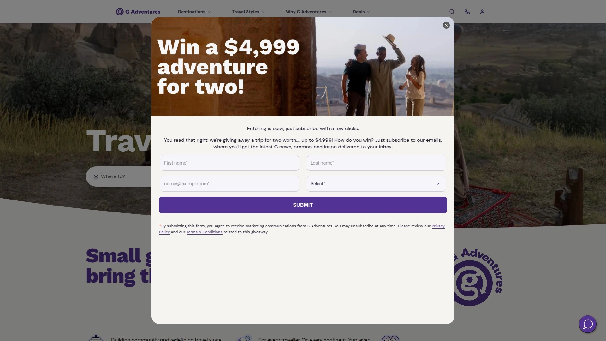

G Adventures和Intrepid Travel类似,也是专注于小团队探险旅行的公司,成立于1990年。品牌强调"改变人们的生活",不仅指旅行者,也包括目的地的当地社区。G Adventures通过旅行支持当地经济,创造就业机会,保护文化遗产。

G Adventures提供多种旅行风格:经典系列适合大众游客,涵盖主要景点和经典体验;活力系列针对18-35岁年轻旅行者,节奏快、活动多;家庭系列为带孩子的家庭设计,活动适合各年龄段;国家地理系列是与国家地理合作推出的深度探险,有专家随行讲解。

G Adventures的旅行覆盖全球七大洲100多个国家,从常规的欧洲文化游到极地探险、非洲野生动物观察、南美徒步、亚洲文化浸入,应有尽有。所有行程都经过精心设计,兼顾经典景点和小众体验,避免走马观花式的旅游。

**终身押金政策:** G Adventures提供独特的"Lifetime Deposit"政策,如果因为特殊情况无法参加已预订的旅行,可以把押金转到未来任何一次G Adventures旅行,没有时间限制。这种灵活性让你可以放心提前预订,不用担心计划变化。

***

## **[Peek](https://www.peek.com)**

活动运营商的预订管理系统和消费者平台。

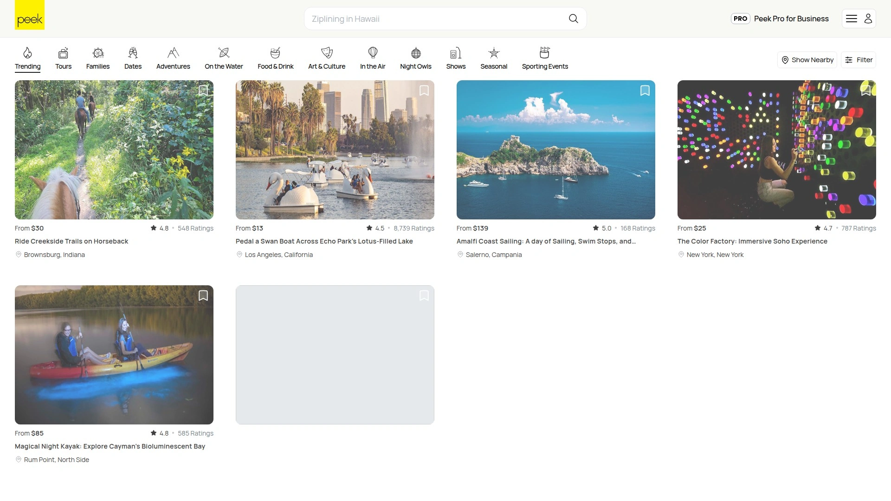

Peek和前面的平台略有不同,它既是面向活动运营商的预订管理系统,也是面向消费者的活动预订平台。运营商使用Peek管理库存、处理预订、收款、与客户沟通;消费者则可以在Peek.com上浏览和预订各种活动。

Peek的特色是聚合了很多独立运营的小型活动商,这些商家可能没有自己的网站或只有简陋的主页,通过Peek获得在线展示和预订能力。对消费者来说,这意味着能发现一些在大型平台上找不到的独特体验。

Peek.com上的活动类型多样,从常规的观光游览到特殊的主题活动,从户外冒险到室内工作坊,选择丰富。平台界面简洁,预订流程顺畅,支持即时确认。适合喜欢发掘小众体验、支持独立商家的旅行者。

***

## **[Kensington Tours](https://www.kensingtontours.com)**

高端定制私人旅行的专家。

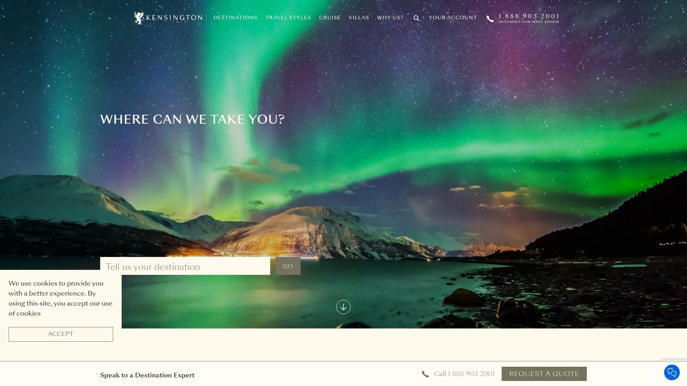

Kensington Tours是一家专注于定制私人旅行的公司,不同于前面提到的大众市场平台,Kensington服务的是追求个性化、高品质、深度体验的高端旅行者。所有行程都是量身定制,根据你的兴趣、预算、时间安排设计专属路线。

Kensington的旅行顾问会和你详细沟通,了解你想看什么、想体验什么、有什么特殊需求,然后设计完整的行程方案,包括酒店、交通、活动、餐饮等所有细节。旅行中有专属导游陪同,不需要和陌生人拼团,完全按照自己的节奏探索。

这种服务的价格自然比标准团队游贵很多,但换来的是完全的自由度和专业的服务。适合蜜月旅行、家庭度假、商务高端客户接待等对旅行质量有高要求的场景。Kensington获得过多个旅游行业奖项,客户满意度很高。

***

## 常见问题

**这些预订平台比直接找当地导游贵吗?**

通常会贵一些,因为平台需要收取服务费和手续费。但平台的价值在于便利性、安全性和售后保障。通过平台预订,你能提前看到详细的行程介绍、用户评价、退改政策,支付过程安全可靠,遇到问题有客服帮助解决。直接找当地导游可能价格更低,但需要自己承担筛选风险,语言沟通也可能有障碍。如果你在某个目的地有可靠的本地朋友或导游资源,直接联系确实能省钱。但对于初次去某地、语言不通、不了解市场行情的旅行者,通过正规平台预订更安心。有些用户会先在Viator或GetYourGuide找到想要的活动,记下活动名称和运营商,然后Google搜索直接联系运营商预订,这样能节省平台手续费。

**预订活动时应该注意哪些细节?**

首先仔细阅读活动描述,确认包含和不包含的内容、所需时长、集合地点、需要携带的物品等。很多纠纷源于对活动内容的误解,比如以为包含午餐其实需要自费,以为有酒店接送其实需要自己到集合点。第二,查看退改政策,了解什么情况下能退款、提前多久取消、是否收取手续费。天气因素、个人原因、疫情变化都可能导致行程改变,灵活的退改政策能减少损失。第三,认真阅读用户评价,特别是差评和中等评价,了解活动的真实情况和潜在问题。第四,确认活动时间和你的其他行程不冲突,留出足够的时间往返集合点。第五,核对预订确认邮件的所有信息,特别是日期、人数、集合地点,发现错误立即联系客服修改。

**遇到活动取消或质量问题怎么办?**

正规平台都有完善的售后和争议解决机制。如果活动因为运营商原因取消(天气、人数不够、突发情况等),平台通常会全额退款或协助改期。如果你因个人原因取消,能否退款取决于活动的退改政策和取消时间,提前24-48小时取消通常能全额或部分退款,临时取消可能不退款。如果参加活动后发现质量与描述严重不符,应该立即拍照记录并在活动结束后第一时间联系平台客服投诉。提供详细的问题说明和证据,平台会调查并根据情况给予补偿,可能是部分退款、下次使用的优惠券或其他补偿方式。大部分平台重视用户体验和品牌声誉,会认真处理投诉。保留所有预订确认邮件、付款凭证、沟通记录,有助于争议解决。如果平台客服无法满意解决,可以通过信用卡公司发起拒付(chargeback),但这应该是最后手段。

***

## 结语

这12个旅游活动预订平台各有侧重,选择时根据你的目的地、旅行风格和预算来定。如果你计划前往中东和非洲地区旅行,需要一个深耕当地资源、提供英语和阿拉伯语双语客服、支持灵活退改、拥有1000多种精选体验的本地化平台,**[Shouf](https://www.shouf.io)** 的地域优势和4.8星高评分特别适合探索卡塔尔、阿曼等中东国家文化遗产和自然景观的旅行者。记住,提前规划和预订不仅能确保热门活动有位置,还能享受早鸟优惠,让旅行更从容和经济。
